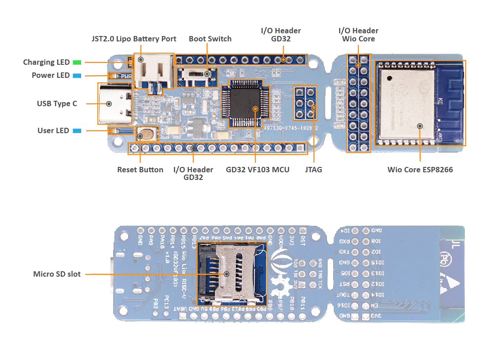

# Wio Lite RISC-V

> Quick start with the Wio Lite RISC-V board



## Quickstart

### Dependencies

- `rust-std` components (pre-compiled `core` crate) for the RISC-V target. Run:

``` console
rustup target add riscv32imac-unknown-none-elf
```

- [dfu-util](http://dfu-util.sourceforge.net/)

- objcopy from RISC-V toolchain from e.g [riscv-binutils-gdb](https://github.com/sifive/riscv-binutils-gdb.git)

### Building

```
cargo build --examples --release --all-features
```

### Using dfu-util for Flashing

1) Extract the binary 

```sh
riscv-nuclei-elf-objcopy -O binary target/riscv32imac-unknown-none-elf/release/blinky firmware.bin
```

2) Flash using `dfu-util`:

```sh
dfu-util -a 0 -s 0x08000000:leave -D firmware.bin
```

## References

https://github.com/riscv-rust/longan-nano

https://www.sigmdel.ca/michel/ha/gd32v/wio_lite_01_en.html
